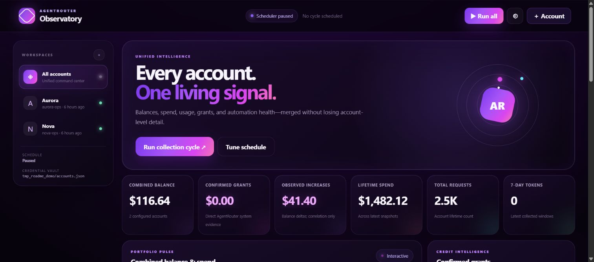
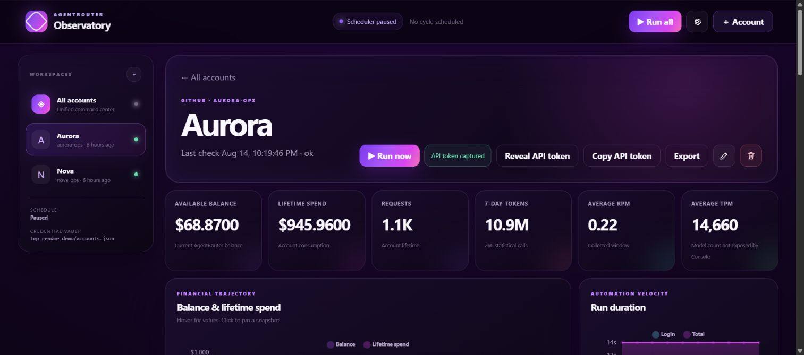

# AgentRouter Observatory

Private, local-first monitoring for one or many AgentRouter accounts. Bun and Playwright collect verified console data, SQLite keeps the timeline, and a responsive dashboard turns balance, usage, grants, and reliability into useful signal.

<p align="center">
  
</p>

<p align="center">
  
</p>

## What it does

- Runs a separate persistent browser session for every GitHub account, records `/console` and `/console/topup`, and verifies AgentRouter logout.
- Retains signed balances, including valid negative balances; retries suspicious transient `$0.00` responses.
- Captures a private API token during the browser cycle, then uses the preserved AgentRouter session for lightweight one-minute balance and usage observations.
- Shows merged and per-account interactive charts, exports, a compact live trace terminal, and a scrollable run archive.
- Keeps captured API tokens in a private, on-demand vault: copy or reveal only the selected account's token when needed.
- Sends quiet Telegram alerts for material balance changes, grants, low credit, repeated failures, and recovery.

## Quick start

Requires Bun 1.3+ and Playwright Chromium.

```bash
bun install --frozen-lockfile
bun run install:browsers                 # Windows/macOS
# Linux: bunx playwright install --with-deps chromium
cp accounts.example.json data/accounts.json
cp settings.example.json data/settings.json
bun run start
```

Open `http://127.0.0.1:3100`, add accounts in the dashboard, and control both the browser-cycle schedule and minute-poll schedule there. Useful checks: `bun run once`, `bun run typecheck`, `bun test`, `bun run test:ui`, and `bun run test:performance`.

## Security and deployment

`data/` holds credentials, private browser state, API tokens, screenshots, SQLite, and Telegram state; it is deliberately ignored by Git. Keep the dashboard on loopback or a private network such as Tailscale—there is no multi-user login layer. The supplied hardened systemd deployment is documented in [Ubuntu deployment](docs/ubuntu-deployment.md); copy `.env.example` or `deploy/agentrouter-monitor.env.example` and keep the real environment file outside the repository.
